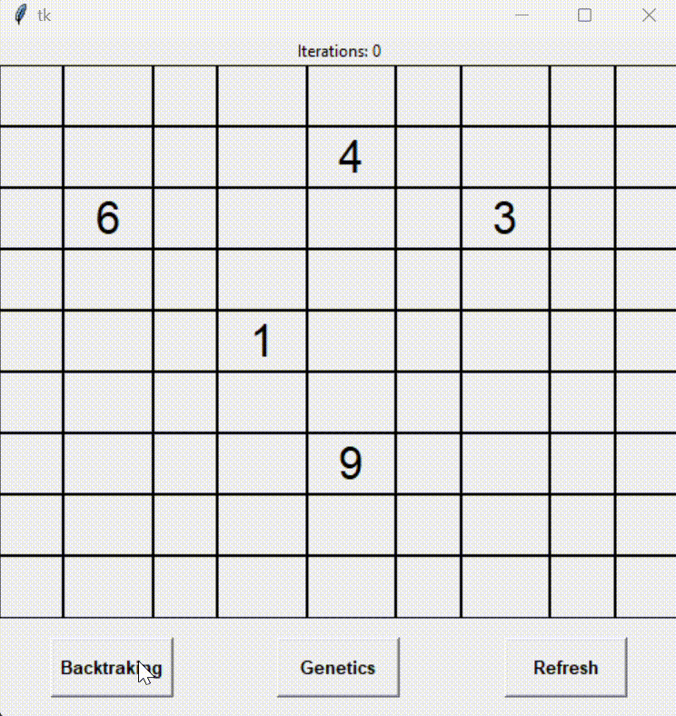

# Real-time Sudoku Solver with Genetic and Backtracking Algorithms

This project is a Sudoku solver implemented in Python using both genetic algorithms and backtracking methods. The graphical user interface (GUI) is built using tkinter, allowing users to input and solve Sudoku puzzles interactively.

## Features

- *Multiple Grid Sizes*: Supports 4x4, 6x6, and 9x9 Sudoku grids.
- *Genetic Algorithm Solver*: Utilizes natural selection, crossover, and mutation processes.
- *Backtracking Solver*: Implements a recursive backtracking algorithm.
- *Interactive GUI*: Allows puzzle input, method selection, and visualization of the solving process.

## Getting Started

### Prerequisites

- Python 3.x
- tkinter (included in standard Python distribution)

## Installation

To clone the repository, open your terminal or command prompt and run the following command:

```sh
git clone https://github.com/HaneenAhmedQandil/AI-Sudoku-Solver-using-Backtracking-and-Genetics-Algorithms.git
cd AI-Sudoku-Solver-using-Backtracking-and-Genetics-Algorithms
```


## How to Use

1. *Choose Grid Size*: Select 4x4, 6x6, or 9x9.
2. *Input Puzzle*: Enter the numbers in the grid.
3. *Submit Puzzle*: Click "Submit" to proceed.
4. *Solve Puzzle*: Choose between "Backtracking" or "Genetics" to solve the puzzle.
5. *Visualize Solution*: Watch the solving process in real-time.

## Visualization of the Solving Process

### Backtracking Algorithm



### Genetic Algorithm Visualization


